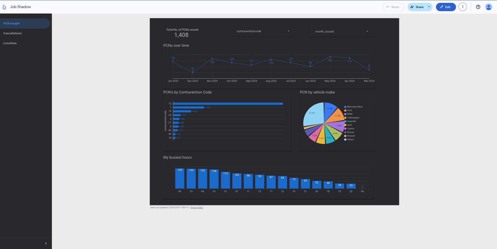
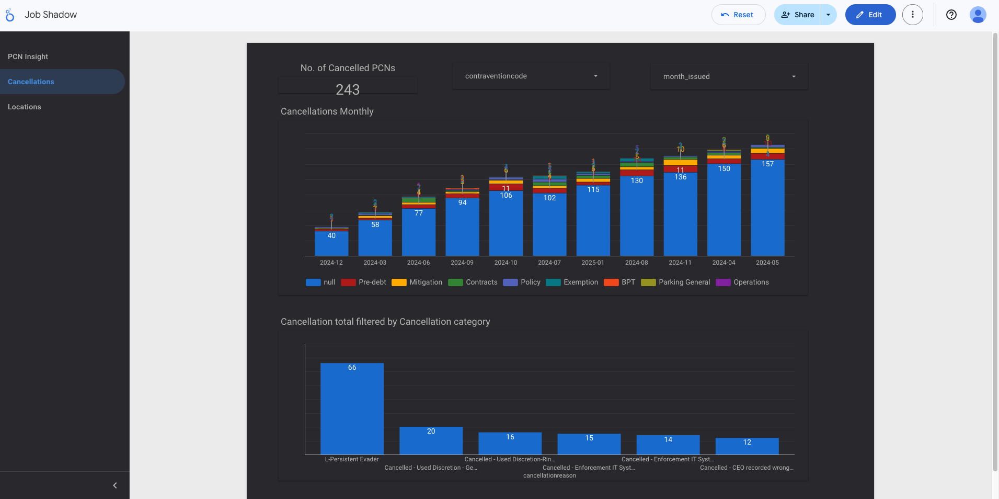

# pcn-dashboard-looker-studio
Analysis of PCN Issuance Trends using Looker Studio (Screenshots Only)

# 📊 PCN Issuance Trends Dashboard – Looker Studio

This project analyzes trends in Penalty Charge Notices (PCNs) using Looker Studio, focusing on key factors such as location, time, cancellation reasons, and vehicle types. It was developed as part of me job shadowing the parking services data analysis, who set me a project to teach and showcase my ability to clean, explore, and visualize real-world datasets.

> ⚠️ **Note**: Due to data confidentiality, the dataset and live dashboard are not publicly shared. This repository contains detailed project documentation and selected screenshots.

---

## 🧠 Project Overview

**Objective:**  
To analyze PCN issuance patterns and identify insights that can improve parking enforcement and operational decision-making.

**Tools Used:**  
- Google Sheets (data cleaning)
- Google Looker Studio (data visualization)

**Scope:**
- Clean and prepare real PCN data
- Create an interactive dashboard
- Generate actionable insights through visual analysis

---

## 🗂️ Data Description (Confidential)

- `pcn`: PCN reference number  
- `pcnissuedate`: Date of issuance  
- `time`: Time of issuance  
- `location`: Street of violation  
- `zone`: Parking zone  
- `contraventioncode`: Violation code  
- `cancellationgroup`: Cancellation category  
- `cancellationreason`: Specific reason for cancellation  

**Preparation Highlights:**
- Removed blanks and corrected dates
- Standardized location/zone fields
- Created a calculated field `Is_Cancelled` for categorization

---

## 🔍 Analytical Approach

**Key Analysis Areas:**
- PCNs by **location** (top streets/zones)
- PCNs by **time** (monthly and hourly trends)
- **Cancellation reasons** and volume
- Vehicle **make/model** distribution

**Visualizations Used:**
- Scorecard: Total PCNs issued
- Line Chart: Monthly PCN trend
- Bar Chart: Top streets for PCN issuance
- Pie Chart: Vehicle makes
- Stacked Bar Chart: Monthly cancellations by reason
- Map: PCN issuance density by location

---

## 💡 Key Insights

- **Top Streets**: Wilton Way, Reading Lane, and Tyssen Street had the most PCNs.
- **Peak Hours**: Most PCNs were issued between **09:00–15:00**.
- **Most Common Violation**: Code 12 – parking without a permit.
- **Cancellation Insight**: Most cancellations were due to "**L-Persistent Evader**".
- **Vehicles**: Mercedes-Benz and Ford topped the list of ticketed vehicles.

---

## 🛠️ Recommendations

- Investigate signage and layout issues on high-PCN streets.
- Address enforcement workflow gaps revealed by cancellation trends.
- Target educational campaigns around the most common contravention codes.
- Use insights to inform parking warden deployment and enforcement policies.

---

## 📸 Screenshots

| Overview Dashboard | Cancellations |
|--------------------|-------------------|
|  |  |

_(You can add more screenshots to the `/screenshots/` folder and link them here.)_

---

## 📌 Conclusion

This project highlights the practical use of Looker Studio to generate insights from real-world urban enforcement data. It demonstrates my ability to handle messy datasets, create clear dashboards, and deliver insights that can impact operational decisions.

